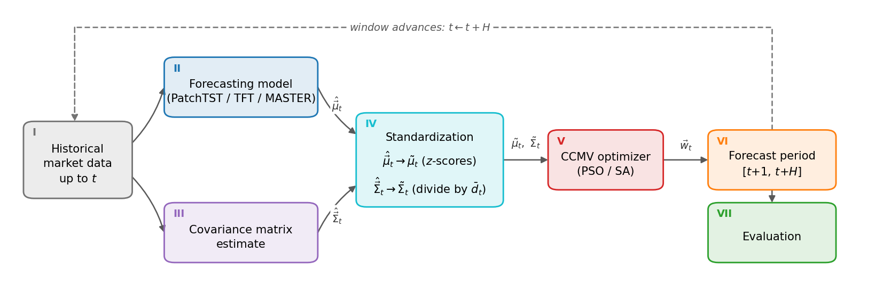

# Portfolio Optimization using Transformers and Global Optimization Algorithms

A research framework for evaluating whether Transformer return forecasts improve
cardinality-constrained portfolio selection over the classical historical
estimate of expected returns.

The pipeline is split into two independently swappable halves — return/risk
estimation and portfolio construction — evaluated in a walk-forward loop:



At each decision point *t* (stage I), the μ branch (a forecasting model, II) and
the Σ branch (covariance estimate, III) run in parallel off the same history. Both
are standardized (IV) and meet in the cardinality-constrained mean–variance
optimizer (V; PSO or SA). The resulting portfolio is held over the next *H* days
(VI), its realised return feeds the out-of-sample evaluation (VII), and the
window advances.

MASTER, TFT and PatchTST are the learned forecasters, each representing a
different way of applying Transformers to financial time series. Replacing the μ
branch with the historical mean (same input window), while holding everything
else fixed, gives each model a matched non-learned baseline — so differences in
the results are attributable to the forecast rather than to the optimizer.

### Experiments

The optimizers are first checked on OR-Library, then the whole procedure is
evaluated on four experiments:

| Experiment | Command | Source / setting |
|---|---|---|
| Optimizer check | `orlib` | OR-Library, Chang et al. (2000) |
| Half-year investing | `wang` | S&P 500, Wang et al. (ICLR 2023), N=494, K=20 |
| Crisis investing | `leow-allweather` | All-Weather basket, Jan–Apr 2020, K=5 |
| Monthly investing | `aprea-djia` | DJIA, Aprea & Sbaiz, 2016–2020, K=10 |
| Long-term investing | `practical` | 61 US stocks, 2011–2024, 10 bps costs, K=20 |

In all four experiments at least one Transformer beats its matched historical
mean, but not always the same one: TFT is strongest on half-year and crisis
investing, PatchTST on monthly and long-term investing. The two optimizers differ
little in portfolio quality; SA is more accurate on OR-Library and more than twice
as fast. Model training dominates the total compute time.

---

## Quick start

```bash
git clone --recurse-submodules <repo-url>
cd portfolio-optimization-using-transformers-and-global-optimization-algorithms
bash setup.sh
```

`setup.sh` creates the conda environment, installs the vendored Transformer
sources at their pinned commits, builds the C++ optimizer, and then verifies all
of it. It is idempotent — re-running skips whatever is already in place.

```bash
bash setup.sh            # install what is missing, then verify
bash setup.sh --check    # verify only, change nothing (exit 1 if not ready)
bash setup.sh --force    # also update the conda env from environment.yml
```

If you cloned without `--recurse-submodules`, `setup.sh` still fixes it — or run
`git submodule update --init` yourself.

Then:

```bash
conda activate magistrska
python -u benchmark/run.py all --dry-run     # wiring only, seconds
python -u benchmark/run.py leow --smoke      # short real run
```

---

## Repository layout

```
benchmark/              Evaluation harness
  run.py                  Single entry point; wires CLI args to tasks
  walkforward.py          Walk-forward engine (decision/realization windows)
  tasks/                  One task_*.py module per benchmark
  utils/                  Shared helpers, data loading, plotting
    reopt_utils.py          Re-optimize from stored μ/Σ without retraining
  configs/                One config per benchmark, named after it
                          (wang.json, practical.json, ...)

estimators/             μ (and Σ) estimation
  master_us.py            MASTER on US equities (Alpha158 + market gating)
  tft_mu.py               Temporal Fusion Transformer (via pytorch-forecasting)
  patchtst_mu.py          PatchTST (via the official repo)
  pipeline.py             Shared training/prediction API used by the harness
  master_lib/             Vendored MASTER core = upstream + master_lib.patch
  master_official/        Submodule, pinned (clone source for master_lib)
  patchtst_official/      Submodule, pinned (imported directly at runtime)

portfolio_optimizers/   C++ solvers
  main.cpp, pso.cpp, sa.cpp, portfolio_common.h
  config.json             Solver hyperparameters
  bridge.py               Python <-> binary bridge

data/                   Benchmark datasets
  orlib/                  OR-Library port1-5 / portef1-5 (Chang et al. 2000)
  literature/wang/        S&P 500 prices for the Wang benchmark
test_results/           Run outputs (gitignored)
```

---

## Running benchmarks

All benchmarks go through one entry point:

```bash
python -u benchmark/run.py <benchmark> [flags]
```

### Primary benchmarks

| Command | What it does |
|---|---|
| `predictive` | IC / RankIC / long-short evaluation — pure forecast quality, no optimizer |
| `orlib` | OR-Library cardinality-constrained frontier (Chang et al. 2000) |
| `orlib --orlib-full` | port1–port5 with 50 λ points |
| `leow` / `leow-allweather` | Leow (All-Weather basket) comparison |
| `wang` | Wang et al. (ICLR 2023) S&P 500 predict-then-optimize |
| `aprea-djia`, `aprea-nasdaq` | Aprea & Sbaiz method substitution, monthly OOS 2016–2020 |
| `practical` | Long-term investor scenario with transaction costs |
| `risk-matched --dir <run>` | Compare at a matched risk level (`--target-P`) |

### Groups

```bash
python -u benchmark/run.py literature   # leow-allweather + wang
python -u benchmark/run.py all          # predictive + orlib + leow-allweather + wang + practical
```

### Fast checks

```bash
python -u benchmark/run.py all --dry-run      # prints the plan, runs nothing
python -u benchmark/run.py leow --smoke       # first seed, few decisions, reduced risk grid
python -u benchmark/run.py wang --smoke
python -u benchmark/run.py practical --smoke
```

`--dry-run` resolves configs and wiring without executing anything, which makes
it a fast sanity check after refactoring. `--smoke` performs real training on a
reduced schedule.

### Useful flags

| Flag | Applies to | Meaning |
|---|---|---|
| `--dry-run` | all | Print the plan, execute nothing |
| `--smoke` | literature runs | Short run: first seed, few decisions |
| `--orlib-full` | `orlib`, `all` | port1–5 with 50 λ points |
| `--cost-bps` | `practical`, `all` | Transaction cost in bps (default 10) |
| `--dir`, `--target-P` | `risk-matched` | Run directory and reference risk point |

Results are written under `test_results/` (gitignored).

---

## The optimizer

Two metaheuristics are implemented in C++ and share one objective:

- **PSO** — particle swarm, following Cura (2009)
- **SA** — simulated annealing with a staged cooling schedule

Selected via `optimizer_type` (`pso`, `sa`, or `all`); hyperparameters live in
`portfolio_optimizers/config.json`. Python calls the binary through
`portfolio_optimizers/bridge.py`.

```bash
make -C portfolio_optimizers          # build
make -C portfolio_optimizers clean
```

---

## Reproducibility

Both vendored Transformers are pinned, and the setup scripts treat the pin as
**input** — they check out the recorded commit rather than adopting upstream
HEAD:

| Component | Pin file | Role |
|---|---|---|
| MASTER | `estimators/master_official_commit.txt` | Clone source for `master_lib/` |
| PatchTST | `estimators/patchtst_official_commit.txt` | Imported directly at runtime |

To move a pin deliberately:

```bash
REPIN=1 bash estimators/setup_patchtst_official.sh   # then commit the pin file
```

### `master_lib` is patched, not copied

`estimators/master_lib/` is upstream-at-the-pin plus `estimators/master_lib.patch`.
The patch carries two changes:

1. A small-universe guard in `drop_extreme()`. Upstream assumes a large
   cross-section (CSI300/500/800). For `N < 40`, `int(0.025*N) == 0` and
   `indices[0:-0]` is the empty slice, so the whole batch is masked, the loss is
   nan and the gradient is zero — the model trains to nothing without raising.
2. Epoch selection and early stopping in `fit()` (`patience`, `max_epochs`,
   returning `best_epoch`), which `master_us.py` depends on.

`setup_master_official.sh` rebuilds `master_lib` as upstream + patch in a staging
directory, verifies by AST that both changes survived, and refuses to install if
either is missing. If you intentionally edit `master_lib`, regenerate the patch:

```bash
bash estimators/setup_master_official.sh --regen-patch
```

---

## Data

Prices are fetched from **Yahoo Finance at runtime**, so full runs need network
access. Configs may instead set `"source": "csv"` with a `path` to a wide price
file — the Wang benchmark uses the bundled `data/literature/wang/snp500.csv`,
and OR-Library reads its instances from `data/orlib/`.

Yahoo does not serve every ticker correctly. A config can name a replacement
series per symbol via `data.series_overrides`, which is how both Aprea runs get
WBA — delisted in 2025, so Yahoo returns no history for it at all. Because those
configs also set `strict_universe` and `enforce_expected_assets`, a ticker that
silently disappears aborts the run instead of quietly shrinking the universe.
Note that this depends on an external URL being reachable at runtime.

---

## Troubleshooting

**`ImportError` from `pytorch_forecasting`** — usually an incompatible
`torchvision`. It is not a dependency; remove it:
`pip uninstall torchvision`.

**`PatchTST_supervised not found`** — the submodule is not checked out:
`bash estimators/setup_patchtst_official.sh`.

**MASTER trains but IC is ~0 on a small universe** — check the `drop_extreme`
guard is present (see above). `bash setup.sh --check` catches a missing
`master_lib`, and `setup_master_official.sh` verifies the patch.

**Optimizer binary not found** — `make -C portfolio_optimizers`.

**Segfault when mixing torch with an OpenMP-linked library on macOS** — set
`KMP_DUPLICATE_LIB_OK=TRUE` and force single-threaded execution in the other
library.

For a full diagnostic of the installation, run `bash setup.sh --check`.
